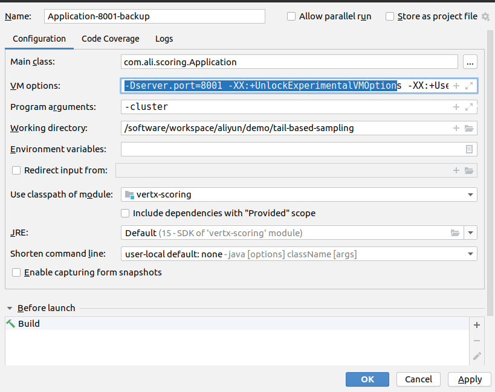

= Vertx-scoring

image:https://img.shields.io/badge/vert.x-4.0.0.CR2-purple.svg[link="https://vertx.io"]

This application was generated using http://start.vertx.io

== Building

To launch your tests:
```
./mvnw clean test
```

To package your application:
```
./mvnw clean package
```

To run your application:
```
./mvnw clean compile exec:java
```

== Help

* https://vertx.io/docs/[Vert.x Documentation]
* https://stackoverflow.com/questions/tagged/vert.x?sort=newest&pageSize=15[Vert.x Stack Overflow]
* https://groups.google.com/forum/?fromgroups#!forum/vertx[Vert.x User Group]
* https://gitter.im/eclipse-vertx/vertx-users[Vert.x Gitter]

## Docker run at local for testing
```
#for checking the log
docker run --rm --cpus=2 --memory=4g -it  --net host -e "SERVER_PORT=8000" --name "clientprocess1" vertx-scoring:1.0 /bin/bash
docker run --rm --cpus=2 --memory=4g -it  --net host -e "SERVER_PORT=8001" --name "clientprocess2" vertx-scoring:1.0 /bin/bash
docker run --rm --cpus=1 --memory=2g -it  --net host -e "SERVER_PORT=8002" --name "clientprocess3" vertx-scoring:1.0 /bin/bash

docker run --rm --cpus=2 -it  --net host -e "SERVER_PORT=8000" --name "clientprocess1" vertx-scoring:1.0 /bin/bash
docker run --rm --cpus=2 -it  --net host -e "SERVER_PORT=8001" --name "clientprocess2" vertx-scoring:1.0 /bin/bash
docker run --rm --cpus=1 -it  --net host -e "SERVER_PORT=8002" --name "clientprocess3" vertx-scoring:1.0 /bin/bash

docker run --rm --net host -e "SERVER_PORT=8081" --name scoring registry.cn-hangzhou.aliyuncs.com/cloud_native_match/scoring:0.1 /bin/bash
```

## local test project
```
java -Dserver.port=8080 -DcheckSumPath=/software/workspace/aliyun/demo/trace/checkSum.data -jar /software/workspace/aliyun/demo/scoring-1.0-SNAPSHOT.jar
java -Dserver.port=8080 -DcheckSumPath=/software/workspace/aliyun/demo/checkSum.big/checkSum.data -jar /software/workspace/aliyun/demo/scoring-1.0-SNAPSHOT.jar

```

## idea startup
```
-Dserver.port=8001 -XX:+UnlockExperimentalVMOptions -XX:+UseZGC -Xmx4G -Xms3G -XX:NewRatio=9 -XX:GCTimeRatio=99
```


## docker tag
```
docker build -t vertx-scoring:1.0 .
docker tag  vertx-scoring:1.0 registry.cn-hangzhou.aliyuncs.com/jiulong/vertx-scoring:3.0
docker push registry.cn-hangzhou.aliyuncs.com/jiulong/vertx-scoring:3.0

```
